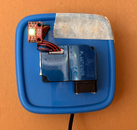
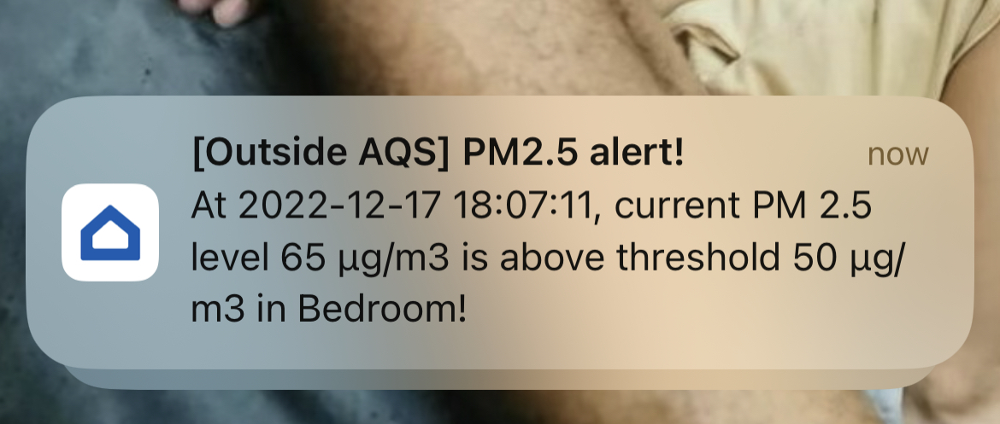
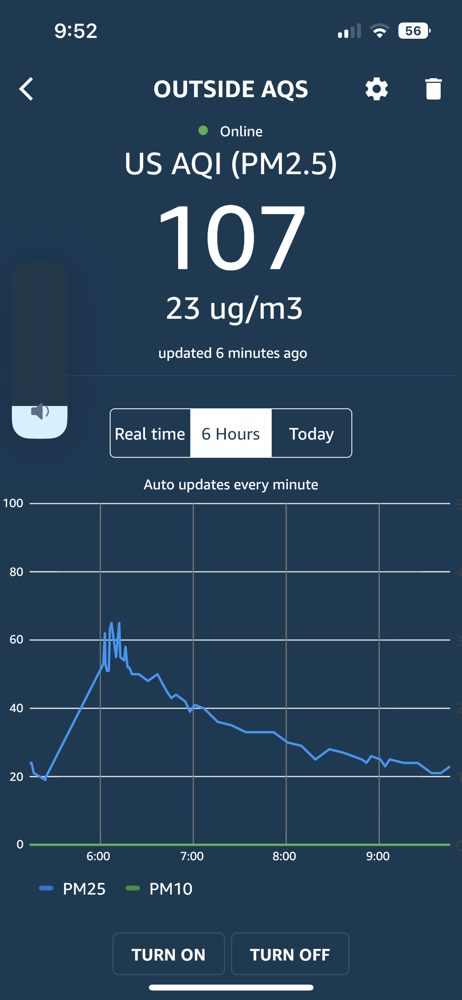

# ESP8266 outdoor PM2.5 Sensor

Outdoor PM 2.5 Sensor with following features

1. Sinric Pro
2. PMS3003 Sensor
3. WS2812 RGB LED Indicator for PM 2.5 level
4. OTA Firmware updates
5. Telnet for debugging

## Pin mapping

| Name     | PIN |
| ---      | ---       |
| PMS3003 TX | GPIO 13 |
| PMS3003 RX | GPIO 12 |
| WS2812 LED | GPIO 2  |

## Installtion 

## Alters

When PM 2.5 level is above 50 ug/mg outside, I get a push notification :)

